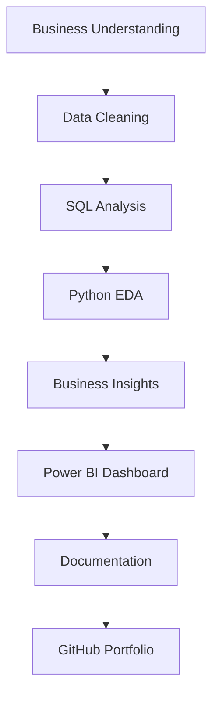

# Amazon Store Sales, Profitability & Returns Analytics

<p align="center">
  <a href="https://github.com/HarshChoudhary2003/Amazon-Store-Sales-Analytics">
    
  </a>
</p>

An end-to-end retail analytics project analyzing sales performance, profitability, customer behavior, product performance, shipping efficiency, payment modes, and return patterns.


## Project Objective
The primary objective of this project is to provide management with a centralized, data-driven analytics solution to monitor sales, profit margins, customer segment behaviors, product performance, operational efficiency, and return trends.

## Business Problem
Retail stores generate massive amounts of transactional data, making it difficult to extract actionable insights. Key business challenges addressed in this project include:
- Identifying which product categories and regions drive the highest revenue and profit.
- Pinpointing loss-making products and sub-categories that negatively impact the bottom line.
- Understanding which shipping modes correlate with higher return rates.
- Analyzing customer purchasing behavior to identify high-value segments.

## Dataset Overview
The dataset simulates Amazon-style retail store transactions. It contains the following key columns:
`Row ID`, `Order ID`, `Order Date`, `Ship Date`, `Ship Mode`, `Customer ID`, `Customer Name`, `Segment`, `Country`, `City`, `State`, `Region`, `Product ID`, `Category`, `Sub-Category`, `Product Name`, `Sales`, `Quantity`, `Profit`, `Returns`, `Payment Mode`.

## Tools and Technologies
- **Database:** SQL, MySQL
- **Programming Language:** Python (Pandas, NumPy)
- **Data Visualization (Python):** Matplotlib, Seaborn
- **Business Intelligence:** Power BI, DAX, Power Query
- **Version Control:** Git and GitHub

## Project Workflow



## SQL Analysis
SQL was used to query the dataset and extract foundational insights, ranging from basic aggregations to advanced analytical functions:
- **Basic Analysis:** Utilized `SELECT`, `WHERE`, `GROUP BY`, `ORDER BY`, aggregate functions, and `HAVING` to summarize total sales, profit, and order volumes.
- **Intermediate Analysis:** Evaluated performance across dimensions such as category, region, segment, payment mode, shipping mode, returns, products, and customers.
- **Advanced Analysis:** Implemented Common Table Expressions (CTEs), window functions (`RANK`, `DENSE_RANK`, `ROW_NUMBER`, `LAG`), running totals, customer segmentation models, and contribution analysis to extract deeper business intelligence.

## Python Analysis
Python was utilized for comprehensive data preprocessing, feature engineering, and exploratory data analysis (EDA):
- **Data Cleaning:** Handled duplicate records, validated missing values, and corrected data types.
- **Feature Engineering:** Created new attributes including `Shipping Days`, `Return Status`, `Profit Margin %`, `Order Year`, `Order Month`, and `Quarter`.
- **Exploratory Data Analysis:** Conducted univariate and bivariate analysis using statistical charting, correlation analysis, and outlier detection.
- **Insights Generation:** Derived actionable business insights and strategic recommendations based on data patterns.

## Power BI Dashboard
A highly interactive Power BI dashboard was developed to enable self-service analytics for stakeholders.

### 1. Executive Overview
Focuses on high-level KPIs and overarching business performance:
- Total Sales, Total Profit, Profit Margin, Total Orders, Return Rate
- Monthly Sales and Profit Trend
- Sales by Category and Customer Segment
- Profit by Region
- Top 10 Products by Sales
- Payment Mode Distribution


### 2. Returns & Product Performance
Focuses on operational efficiency, product viability, and return patterns:
- Returned Orders, Return Rate, Loss-Making Products
- Average Order Value, Average Shipping Days
- Return Rate by Category and Ship Mode
- Profit by Sub-Category and State-wise Profit
- Bottom 10 Products by Profit
- Product Performance Table with conditional formatting


## Key Business Insights
- **Sales & Profitability:** Technology is the most profitable category, whereas Furniture generates strong revenue but operates at a very low profit margin.
- **Customer Segmentation:** The 'Consumer' segment consistently contributes the highest proportion of total sales (~$753K), whereas the 'Home Office' segment generates higher average order values.
- **Returns & Operations:** 'First Class' shipping exhibits the highest return rate at 13.23%, whereas 'Same Day' shipping actually has the lowest return rate at 6.13%.
- **Geographical Performance:** The West region is the strongest performer contributing the most to both total sales and profit, while the South region underperforms.

## Business Recommendations
- **Product Strategy:** Review the pricing and operational costs of loss-making sub-categories (like Furniture). Consider discontinuing consistently unprofitable products or bundling them with high-margin items.
- **Shipping Optimization:** Investigate the underlying causes of the high return rate (13.23%) associated with First Class shipping to improve logistics and customer satisfaction.
- **Targeted Marketing:** Design targeted promotional campaigns for the highest-value customer segments to boost retention and lifetime value.
- **Regional Focus:** Conduct a root-cause analysis in underperforming states (and the South region) to determine if local pricing strategies or supply chain inefficiencies are negatively impacting profit margins.

## Folder Structure
```text
Amazon-Store-Sales-Analytics/
├── Dataset/
│   ├── Amazon Store Sales Data.xlsx - Sheet1 (1) (1).csv
│   └── clean_amazon_store_sales.csv
├── SQL/
│   ├── basic_analysis.sql
│   ├── intermediate_analysis.sql
│   └── advanced_analysis.sql
├── Python/
│   ├── 01_Data_Cleaning.ipynb
│   ├── 02_Exploratory_Data_Analysis.ipynb
│   └── 03_Business_Insights_and_Recommendations.ipynb
├── PowerBI/
│   └── amazon_store_analytics.pbix
├── Documentation/
│   ├── Business_Insights_and_Recommendations.md
│   ├── Final Project Documentation.docx
│   └── Business_Requirement_Document.md
├── Reports/
│   ├── bottom_10_products.csv
│   ├── category_summary.csv
│   ├── kpi_summary.csv
│   ├── region_summary.csv
│   ├── return_by_category.csv
│   ├── return_by_shipping_mode.csv
│   ├── segment_summary.csv
│   └── top_10_products.csv
├── Screenshots/
│   ├── Executive Overview.png
│   └── Returns & Product Performance.png
├── README.md
└── requirements.txt
```

## How to Run the Project
1. **Clone the repository:**
   ```bash
   git clone https://github.com/HarshChoudhary2003/Amazon-Store-Sales-Analytics.git
   ```
2. **Database Setup:** 
   - Import the dataset from the `Dataset/` folder into your MySQL environment.
   - Execute the SQL scripts in the `SQL/` folder in sequential order to review the queries and analysis.
3. **Python Environment:** 
   - Install the required dependencies: `pip install -r requirements.txt`
   - Open and run the Jupyter notebooks in the `Python/` directory to follow the EDA process.
4. **Power BI:** 
   - Open the `.pbix` file located in the `PowerBI/` folder to interact with the dashboard.

## Skills Demonstrated
- Data Modeling and Database Management (MySQL)
- Advanced SQL Querying (Window Functions, CTEs, Aggregations)
- Data Cleaning, Manipulation, and EDA (Python, Pandas, NumPy)
- Statistical Data Visualization (Matplotlib, Seaborn)
- Dashboard Design and DAX Development (Power BI)
- Analytical Problem Solving and Business Storytelling

## Future Improvements
- Implement a predictive machine learning model to forecast future sales and predict potential product returns.
- Automate the ETL pipeline using Python and Airflow to refresh the Power BI dashboard dynamically.
- Incorporate customer sentiment analysis based on product reviews.

## Author
**Harsh Choudhary**  
GitHub: [https://github.com/HarshChoudhary2003](https://github.com/HarshChoudhary2003)